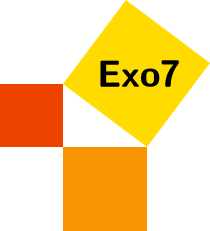

QCM de mathématiques
====================

Vous trouverez ici deux choses :

* des qcm (questions à choix multiples) de mathématiques pour l'université,
* des outils pour créer, gérer et transformer des qcm.

Questions
=========

* 360 questions niveau L1 - premier semestre
  - [Questions](https://github.com/exo7math/qcm-exo7/blob/master/questions-lille-1/qcm-lille-1.pdf)
  - [Questions corrigées](https://github.com/exo7math/qcm-exo7/blob/master/questions-lille-1/qcm-lille-1-correc.pdf)
  - par Arnaud Bodin, Abdellah Hanani, Mohamed Mzari de l'université de Lille

* 360 questions niveau L1 - second semestre
  - [Questions](https://github.com/exo7math/qcm-exo7/blob/master/questions-lille-2/qcm-lille-2.pdf)
  - [Questions corrigées](https://github.com/exo7math/qcm-exo7/blob/master/questions-lille-2/qcm-lille-2-correc.pdf)
  - par Abdellah Hanani, Mohamed Mzari de l'université de Lille

* 46 questions de probabilité niveau L1
  - [Questions](https://github.com/exo7math/qcm-exo7/blob/master/questions-probabilites-worms/qcm-worms.pdf)
  - [Questions corrigées](https://github.com/exo7math/qcm-exo7/blob/master/questions-probabilites-worms/qcm-worms-correc.pdf)
  - par Julien Worms de l'université de Versailles

* 30 questions de révisions niveau L1
  - [Questions](https://github.com/exo7math/qcm-exo7/blob/master/questions-arnaud/qcm-arnaud.pdf)
  - [Questions corrigées](https://github.com/exo7math/qcm-exo7/blob/master/questions-arnaud/qcm-arnaud-correc.pdf)
  - par Arnaud Bodin (alors à l'université de Toulouse)

Les sources sont disponibles sur cette page 
[GitHub - Exo7 -QCM](https://github.com/exo7math/qcm-exo7 "github.com/exo7math/qcm-exo7").

Outils
======

Cette page GitHub met aussi à disposition des outils pour créer des qcm de mathématiques.

En résumé, vous pouvez:
  * créer des questions en LaTeX,
  * les exporter vers d'autres formats (AMC, yaml, xml, moodle, scenarii).

Vous trouverez toutes les explications ici :
[exo7qcm-readme.pdf](https://github.com/exo7math/qcm-exo7/blob/master/exo7qcm-readme.pdf)

Ce qui n'est pas le but ici : gérer de beaux questionnaires papiers (c'est le but d'AMC), ni des questionnaires web (moodle et autres le font). De plus, aucun élément de barème n'apparaît dans l'énoncé des questions/réponses. 

Les documents sont diffusés sous la licence *Creative Commons -- BY-NC-SA -- 4.0 FR*.

